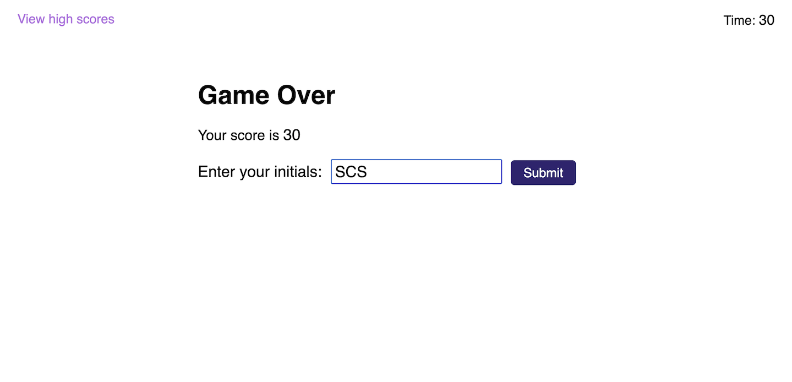

# Coding Quiz Challenge

## Description

This project is a multiple-choice quiz about JavaScript coding, meant to emulate the sorts of questions a developer might encounter in a coding assessment as part of a job interview. Additionally, this project served as a way for me to practice my HTML, CSS, and especially JavaScript skills, including core JavaScript and the HTML DOM and localStorage APIs.

The quiz is timed, with incorrect answers penalizing the remaining time by ten seconds. The goal of the quiz is to complete the quiz with the highest time remaining. The quiz ends when all questions are answered or when the time reaches zero. Players may submit their scores, and the five highest scores are stored locally in the browser.

index.html contains the initial content of the starting screen, and highscore.html contains the initial content of the high score page. style.css contains the stylings for both HTML files. questions.js contains the questions and answers for the quiz. script.js contains the code that dynamically renders the questions and game over screens in the index.html page and handles the game logic of the quiz. score.js contains the code that renders the high score list to, and otherwise provides the functionality for, the high score page.

In completing this project, I learned the benefits of splitting code up into multiple files. Initially, I planned to include only a single HTML file and a single JS file which would have contained all of my content and code, respectively. Splitting the code up allowed better logical separation of different sections and functionalities, and kept the files from getting as long and cluttered as they would have otherwise.

## Installation

N/A

## Usage

To view the quiz, navigate to https://spencersurface.github.io/code-quiz in your web browser.

To start the quiz, click on the "Start Quiz" button on the starting screen. Once the quiz has started, answer each question by clicking on the button that displays the correct multiple-choice answer. After the quiz has ended, enter your initials so that your score can be saved locally in the browser. This will take you to the high score screen, which you can also access at any time by clicking on the "View high scores" link in the upper left corner. In the high score screen, you can return to the start screen by clicking on the "Go Back" button, or clear the stored high scores by clicking on the "Clear Scores" button.

Here are some screenshots demonstrating how the different parts of the quiz should appear:

- index.html

    - Start screen: 

    - Question screen: 

    - Game over screen: 

- highscore.html

    - High score screen: 

## Credits

This project consists entirely of code written by me. The appearance and content of the quiz were made to closely match a mockup GIF provided by edX Boot Camps LLC, though I opted to write all-original questions. The two HTML file, three JS file structure of the project was suggested by Jonathon Moore, the boot camp instructor. This README file and the screenshots of the completed project were created by me.

## License

No license at this time.